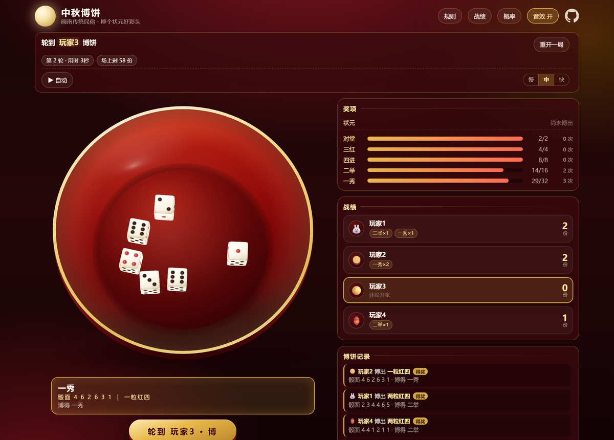
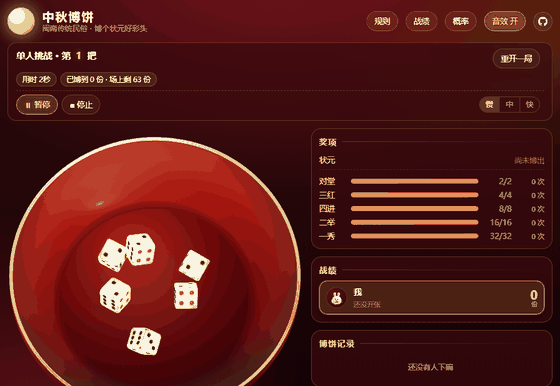
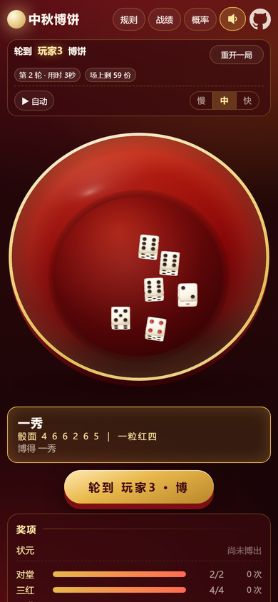

# 中秋博饼

> 闽南传统民俗 · 博个状元好彩头

[](https://woo3an.top/bobing/)
[](https://workers.cloudflare.com/)
[](#技术)
[](LICENSE)

单文件、零依赖的闽南中秋博饼网页游戏——**打开就能玩，不用装任何东西**，也能开房间和朋友跨设备联机。



**自动模式**（挂机也能一路博到本局结束，骰子在碗里翻滚、战绩实时累计）：



手机上也一样（顶栏、碗与骰子按屏幕自适应）：

 

| 入口 | 地址 | 说明 |
|---|---|---|
| 在线体验（主） | <https://woo3an.top/bobing/> | 联机走同源 WebSocket |
| 备用入口 | <https://woo3an.github.io/bobing/> | GitHub Pages，跨站 WebSocket 照样连 |

两个网址是同一份游戏、连同一个房间服务——一人从哪个进、另一人从另一个进，照样能进同一间房。

## 目录

- [玩法](#玩法)
- [功能](#功能)
- [联机](#联机)
- [技术](#技术)
- [本地运行](#本地运行)
- [部署](#部署)
- [自检](#自检)
- [目录结构](#目录结构)
- [运行成本](#运行成本)
- [更新日志](#更新日志)

## 玩法

六颗骰子丢进大红碗，看红四点（4 点）的多少定科名。

| 奖项 | 说明 | 份数 | 概率 | 几种骰面 |
|---|---|---|---|---|
| 状元插金花 | 四粒红四带两粒红一（**最大**） | 1 | 0.032% | 15 |
| 六抔红 | 六粒全是红四点 | ↑ | 0.002% | 1 |
| 遍地锦 | 六粒全是红一点 | ↑ | 0.002% | 1 |
| 黑六勃 | 六粒相同黑点数（二/三/五/六各一种） | ↑ | 0.009% | **4** |
| 五红（五王） | 五粒红四，比带点 | ↑ | 0.064% | 30 |
| 五子登科 | 五粒相同，比剩余那颗 | ↑ | 0.322% | 150 |
| 四点红 | 四粒红四，比另外两颗之和 | ↑ | 0.772% | 360 |
| 对堂 | 一二三四五六各一粒 | 2 | 1.54% | 720 |
| 三红 | 三粒红四 | 4 | 5.36% | 2500 |
| 四进 | 四粒相同（四点除外） | 8 | 4.02% | 1875 |
| 二举 | 两粒红四 | 16 | 19.93% | 9300 |
| 一秀 | 一粒红四 | 32 | 37.29% | 17400 |

> 概率是「这个等级」的合计概率，穷举 6⁶ = 46656 种骰面组合精确算出。
> 单个骰面组合都是 1/46656 ≈ 0.002%——「黑六勃」之所以是 0.009%，是因为它把
> **222222 / 333333 / 555555 / 666666** 四种骰面合在一起算；换成单个点数看，六个一、六个四、六个六完全同概率。
>
> 上表（有奖的等级）合计 **69.35%**，剩下的 **30.65%** 是「无红四」——一颗红四都没有，本轮空手。
> 所以这 12 行加起来只有 69.35%，没到 100% 是正常的。

<details>
<summary><b>规则要点（点击展开）</b></summary>

- **状元插金花最大**（按厦门现行玩法，不采「六抔红 > 五红 > 五子 > 插金花」的古法）
- **五红大于任何五子登科**；五子登科比剩下那颗骰子的大小
- 本级奖项发完就**空手**，不作他用
- **状元只有一份，以各人最后博出的状元为准**——自己再博出更小的也会降级，此时别人早前博出的更大就能拿走
- **收官轮**：当**最后一个奖项有了主**（无论非状元的最后一份被博走，还是只剩状元没出时有人博出状元），
  牌局都不就此结束——从**博出它那个人的下一位**开始最后一轮，每人再各博一次；转回得奖者本人即结算。
  收官轮转完若状元还没有主，再补一轮，直到博出为止

</details>

## 功能

- **2–6 人本地传阅** / **单人挑战**——一台设备围一圈轮流博
- **联机对战**——开局页点「🌐 联机对战」创建房间，把 4 位房间号发给朋友即可加入；
  同一浏览器开两个标签页就能先试玩（同机演示）
- **掉线 / 挂机全自动处置**——见 [联机](#联机)，不用任何人手动操作
- **自动模式**——一键挂机：自动替所有玩家轮流博到本局结束（含收官轮与结算），
  随时 ⏸ 暂停 / ▶ 继续 / ■ 停止（局面保留）；慢 / 中 / 快三档节奏，快档跳过骰子动画直接落定；
  本局结束时自动模式自己停
- **桌面 / 手机双端适配**——响应式布局，手机上碗与骰子自动缩到合适大小，排版不会跳
- **自定义奖项数量**——除状元（固定 1 份，因为它唯一、可被更大的状元夺走）外，
  对堂 / 三红 / 四进 / 二举 / 一秀各级份数都能改，总数自动跟着变
- **实时概率统计**——每个奖项的理论概率 + 本局实际频率对照
- **完整碗型建模**——内联 SVG 画的碗：碗口滚金边、内壁、碗底，与骰子共用同一个相机
  （相机仰角 72° = 90° − 骰子平面倾角 18°）
- **物理骰子**——六颗同时抛出，真刚体模拟（弹跳 / 互相碰撞 / 撞碗壁），无穿模
- **音频现场合成**——WebAudio 合成的骰子撞陶瓷声，不依赖任何音频文件
- 战绩历史（存本地）

## 联机

房间服务是自建的 **Cloudflare Worker + Durable Object**（WebSocket 推送，零月费、零配置）。

### 掉线 / 挂机全自动处置

| 情况 | 系统行为 |
|---|---|
| 轮到某人 15 秒没动静（页面开着也算挂机） | 判定托管，自动替他博 |
| 直接掉线（关窗口 / 切后台被杀） | 等 5 秒后开始替他博 |
| 托管中 | 每 0.4 秒博一把，最多 5 把（真实掷骰） |
| 满 5 把后 | 每轮到他自动跳过（0.2 秒，几乎无等待），跳过有记录 |
| 全场都进入跳过阶段 | 停止刷跳过（没有观众了，既省额度也不刷屏），静默等 2 分钟 |
| 托管起 2 分钟内回来 | 一切照常，接着博（本人随时可点「取消代博 / 取消自动跳过」夺回控制权） |
| 超过 2 分钟（从**第一次被代博**算起） | 彻底断线：只提示一次「已移出本局」，之后静默跳过、连本人也无法再取消；奖品按已博到的结算。重连后可以**观战**，下一局照常参与 |
| 所有人都被移出 | 房间**自动解散**（定时器兜底检查：全员超时未回就没必要留着） |
| 没有任何自由玩家（最后一人也掉线） | 不卡在「代博中」：显示「全员掉线 · 本局已停止，2 分钟后自动解散」 |

<details>
<summary><b>更多机制细节（夺回控制权 / 观战 / 认领 / 重连）</b></summary>

- **本人可以随时夺回控制权**：被托管期间主按钮**始终**是「取消代博（n/5）/ 取消自动跳过 · 我回来了」
  且随时可点（不管当前轮到谁、哪怕别人正在博）；点一下即**真正取消**托管、按钮立刻变回
  「轮到你了 · 博！」，如果正轮到你还会顺手替你博这一把。之后再发呆 15 秒才会重新托管，
  托管期内想回来随时能回来。
- **观战模式**：超过 2 分钟被移出的人重连**不会被拒**，而是进来只看不玩——牌局实时可见，
  掷骰 / 跳过 / 取消全部无效；座次和已博到的奖品保留。两条入口都支持：
  ① 原身份重连；② 页面被杀后身份丢失 → 按名字认领（同名且已离线才允许接管）。
- **防冒名**：同名但在线的座次不能被顶替；不同名的新面孔在开局后一律拒绝。
- **重连**：回来直接定位到最新一轮（错过的把次静默同步，不逐把回放动画）。
- **再来一局**：打完一局房主点「再来一局」，原班人马直接开下一局（不用重建房间）。
- **房主顺位**：房主退出后自动移交给名单里的下一位，不影响别人继续玩。
- **有人退出会通知全场**：「XX 离开了房间」；打了一半有人退出则本局解散（避免全场干等）。

</details>

### 传输层

游戏内置四个可插拔传输层，按环境自动选择：

| 传输层 | 使用场景 | 说明 |
|---|---|---|
| **WS**（主力） | 线上默认 | Cloudflare Worker + Durable Object，每房间一个 DO |
| Local | `file://` 打开 / 自测 | 同机多标签页，靠 localStorage 同步 |
| TCB（兜底） | WS 不可用时 | 腾讯云开发 CloudBase，1.2 秒自适应轮询 |
| selftest | 自动化探针 | 无网络的最简实现 |

## 技术

**单个 HTML 文件，零依赖**——没有 CDN、没有构建步骤、没有图片字体音频文件。
所有视觉用内联 SVG / CSS 画出来，所有音效用 WebAudio 现场合成。
放到任何静态托管上都能跑，也可以直接下载下来双击打开。

**联机是可选的外挂后端**（`cf/` 目录，Cloudflare Worker + Durable Object，约 300 行）：

- 一个房间号 = 一个 Durable Object，WebSocket 常驻推送（**不轮询**），房间记录存 DO 的 SQLite
- 玩家各自本地跑规则引擎，服务端只做「房间记录 + 事件追加 + 托管状态」，两端只交换 6 颗骰子点数
- 因为服务端不跑规则，所以没有防作弊——适合熟人局
- 碗的每个坐标都由 `tools/gen_bowl.js` 从（仰角 / 底半径比 / 深度比）推出；
  这个相机角度下**外壁只剩碗口近缘以下一条窄月牙**（高度 = 碗深·cosθ），圈足被碗口完全挡住——
  所以碗只画到投影上真能被看见的那部分，多画一笔都是错的

## 本地运行

```bash
git clone https://github.com/Woo3aN/bobing.git
cd bobing

# 直接双击 博饼.html 即可玩；或起个本地服务：
python -m http.server 8000

# 联机调试：起本地房间服务（协议与线上一致）
cd cf && node mock-server.js        # 默认 127.0.0.1:8911
```

调试 / 预览参数：

| 参数 | 作用 |
|---|---|
| `?demo=N` | 直接开一桌 4 人并先博 N 次 |
| `?demo=N&solo=1` | 直接进单人挑战 |
| `&open=rules\|hist\|stat\|result` | 直接打开对应弹层 |
| `?ws=wss://.../ws` | 覆盖房间服务地址 |
| `?idlems=` / `?offlinems=` | 覆盖挂机判定 / 彻底断线时限（自测用） |

## 部署

```bash
# 联机服务（Cloudflare Worker + Durable Object）
cd cf && npx wrangler deploy        # 首次需 npx wrangler login

# 静态站点（GitHub Pages，本仓库即发布源）
cp 博饼.html publish/index.html
cd publish && git add -A && git commit -m "..." && git push
```

> 改 `cf/src/worker.js` 后记得同步 `cf/public/index.html`（游戏副本）再部署。

## 自检

```bash
# 全套浏览器探针（13 组 481 项断言 + 520/360 窄视口回归），一条命令跑完
bash tools/run_probes.sh

# 协议测试（59 项，需先起 mock-server）
cd cf && node mock-server.js &
WS_URL=ws://127.0.0.1:8911/ws node test-room.js

# 浏览器打开：
#   cf/dev/__e2e.html        端到端 23 步（建房→加入→对博→掉线托管→重连→再来一局）
#   cf/public/dev/__auto.html 托管/取消/观战专项 9 步（线上也可直接打开自测）
```

## 目录结构

```
bobing/
├── 博饼.html            游戏本体（单文件、零依赖，所有功能都在这里）
├── tools/
│   ├── run_probes.sh    一键跑全套浏览器探针
│   ├── gen_bowl.js      碗与骰子的几何生成器
│   └── bowl_base.html   建模基线（重建碗时从这里改）
├── cf/                  联机服务
│   ├── src/worker.js    Worker + RoomDO（房间状态机 / 广播 / 托管）
│   ├── wrangler.jsonc   部署配置（静态资源 + DO 绑定 + 域名路由）
│   ├── mock-server.js   本地模拟服务（协议与线上一致）
│   ├── test-room.js     协议测试
│   ├── dev/__e2e.html   浏览器端到端测试
│   └── public/          部署产物（index.html 为游戏副本）
└── publish/             静态站点发布源（GitHub Pages）
```

## 运行成本

**约 ¥ 35 / 年**——唯一的固定支出是好记的域名。

| 项目 | 费用 |
|---|---|
| 域名 `woo3an.top` | 约 ¥ 35 / 年（`.top` 标准续费价：腾讯云 ¥34、西部数码 ¥31、阿里云 ¥39；首年注册常有 ¥1–14 的优惠价） |
| Cloudflare Workers + Durable Object | ¥ 0（免费额度够每天约 300 局） |
| GitHub Pages 托管（备用入口） | ¥ 0 |
| **合计** | **约 ¥ 35 / 年**（折合每月不到 3 元） |

自建服务器方案（云主机 + 长连接服务）每月至少要几十元，这里用 Worker + DO 的免费用量
把后端成本压到了零。

<details>
<summary><b>免费额度实测口径（点击展开）</b></summary>

限额取自 Cloudflare 官方定价页（Workers Free），按 6 人局 × 250 掷 × 30 分钟估算：

| 资源 | 免费额度/天 | 每局消耗 | 折合每天 |
|---|---|---|---|
| **SQLite 行写**（瓶颈） | 100,000 | **≈ 270–285 行**（每掷一次存一次快照，put 单 key 计 1 行；托管/取消/点名等状态写入每局再多约 10 行） | **≈ 370 局** |
| DO 请求 | 100,000 | ≈ 25 次（入站 WS 消息按 20:1 折算 + 连接建立） | ≈ 4,000 局 |
| Worker 请求 | 100,000 | ≈ 15 次（只看 WS 升级与查询口，掷骰走 WS 不计数） | ≈ 6,600 局 |
| SQLite 行读 | 5,000,000 | ≈ 50 行（休眠唤醒后重读快照） | ≈ 10 万局 |
| 计算时长 | 13,000 GB-s | ≈ 0.6 GB-s（Hibernation：只在处理消息时计费，挂机不烧） | ≈ 2 万局 |

- 结论：**免费额度每天约 300 局**（安全日用 250 局以内，折合约 7.5 万次掷骰）
- 全员挂机时自动循环停止写跳过事件，实际消耗更低
- 超出后当天该类型操作会报错（UTC 0 点重置），**不会产生账单**；
  真不够时 Workers Paid $5/月，行写额度提升到 5000 万/月（≈ 5,900 局/天）

</details>

## 更新日志

见 [CHANGELOG.md](CHANGELOG.md)。

## License

[MIT](LICENSE) © WooSaN

---

中秋快乐，博个状元好彩头 🌕
